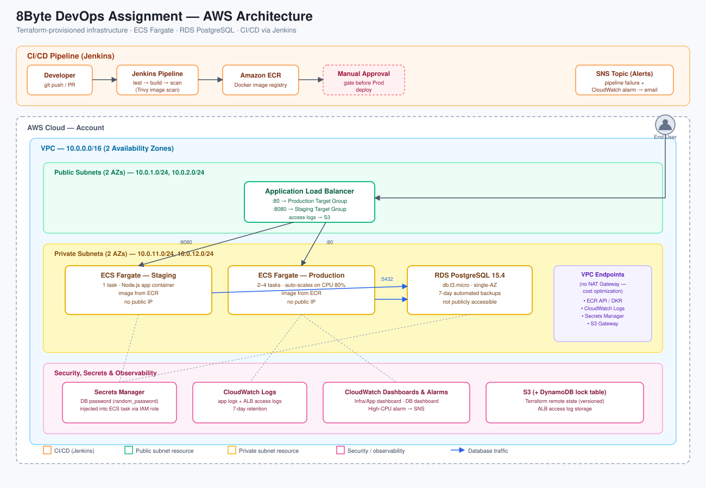

# 8Byte DevOps Engineering Assignment

This repository contains the complete infrastructure, application, and CI/CD code for a scalable, secure, and monitored cloud deployment on AWS.

##  Architecture Overview 
## Architecture Diagram

The infrastructure is provisioned using **Terraform** and follows AWS best practices for high availability and security:
- **Networking (VPC):** Custom VPC with public subnets (for the Load Balancer) and private subnets (for the App and Database).
- **Remote State Backend:** Managed securely via an S3 backend and a DynamoDB lock table for state locking.
- **Compute (ECS Fargate):** Serverless container hosting for the Node.js application, ensuring seamless scaling without managing EC2 instances.
- **Database (RDS):** PostgreSQL database deployed in private subnets with strict Security Group rules and database credentials secured via AWS Secrets Manager.

##  Security Considerations

- **Network Isolation:** Application containers and the PostgreSQL database reside entirely in private subnets with no direct public internet exposure. 
- **Secret Management:** Database passwords are dynamically generated using Terraform and securely stored in **AWS Secrets Manager**, injected directly to ECS tasks via execution roles rather than plaintext environment variables.
- **Least-Privilege IAM:** IAM roles and policies are scoped strictly to the minimum permissions required for execution, pushing to ECR, and logging.
- **Container Scanning:** The CI/CD pipeline integrates **Trivy** to scan built container images for high and critical vulnerabilities prior to deployment.

##  Cost Optimization

- **Serverless Compute (Fargate):** Utilizing ECS Fargate avoids the idle cost of keeping dedicated EC2 virtual machines running 24/7.
- **Right-Sized Resources:** Deployed standard lightweight resources (`db.t3.micro` for the database and minimal Fargate task sizes) optimized for assignment execution without over-provisioning.
- **Log Retention Policy:** CloudWatch log groups enforce a strict 7-day retention policy to prevent runaway storage costs over time.
- **Scope Trade-offs:** HTTPS/Multi-AZ configurations were omitted to keep infrastructure costs minimal for this assignment; I would add both for a production workload.

##  CI/CD Pipeline (Jenkins)

Deployment automation is handled via a **branch-aware** `Jenkinsfile`. The pipeline enforces strict CI/CD gating based on Git events:

- **On Pull Request Creation:**
  1. **Checkout & Test:** Installs Node.js dependencies and executes integration tests against the API endpoints (`/health` and `/api/data`) using **Jest** and **Supertest** to prevent broken code from being merged.
  
- **On Merge to `main`:**
  2. **Build Docker Image:** Containerizes the application and dynamically retrieves the ECR repository URI.
  3. **Security Scan (Trivy):** Runs a vulnerability scan against the built container image checking for HIGH and CRITICAL vulnerabilities.
  4. **Push to ECR:** Authenticates with AWS and pushes the container image (tagged with the build number and `latest`) to Amazon ECR.
  5. **Deploy to Staging:** Automatically updates the AWS ECS Fargate staging service with the new image.
  6. **Manual Approval Gate:** The pipeline safely halts, requiring manual human approval in the Jenkins UI before promoting the build to Production.
  7. **Deploy to Production:** Upon approval, the image is promoted to the production environment.
##  Monitoring & Logging (CloudWatch)

Centralized observability is configured directly via Terraform:
- **Log Groups:** Captures Application logs and Load Balancer access logs with a managed retention policy.
- **Dashboards:** 
  - *Infra & App Dashboard:* Tracks ECS CPU, Memory utilization, and ALB request/error metrics.
  - *Database Dashboard:* Tracks RDS CPU and active database connections.

##  How to Deploy

To deploy this environment from scratch:

1. **Bootstrap the Remote Backend:**
   - Navigate to the `bootstrap/` directory: `cd bootstrap`
   - Run `terraform init` and `terraform apply` to provision the shared S3 state bucket and DynamoDB lock table.
2. **Provision Main Infrastructure:**
   - Navigate to the `terraform/` directory: `cd ../terraform`
   - Initialize the backend: `terraform init`
   - Review the execution plan: `terraform plan`
   - Apply the infrastructure: `terraform apply`
